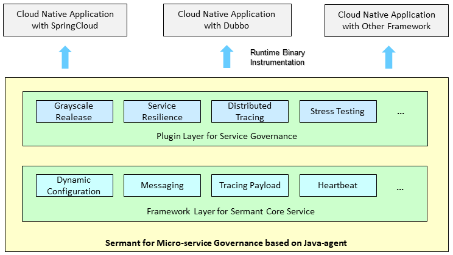
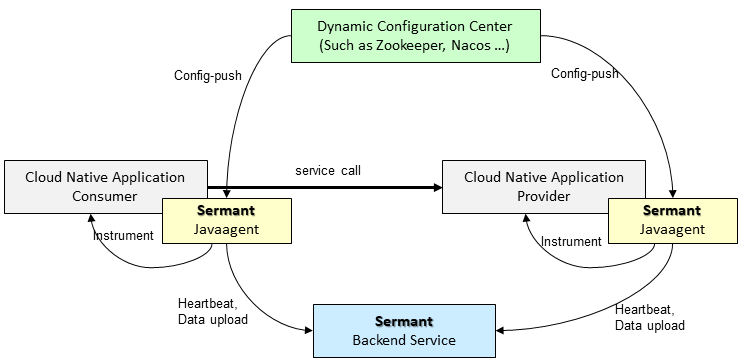

<div align="center">
<p></p><p></p>
<p>
    
</p>
<h1>A Proxyless Service Mesh Solution Based on Java Agent</h1>

[简体中文](README-zh.md) | [English](README.md) 

[](https://gitter.im/SermantUsers/community?utm_source=badge&utm_medium=badge&utm_campaign=pr-badge)
[](https://www.apache.org/licenses/LICENSE-2.0.html)
[](https://github.com/huaweicloud/Sermant/actions?query=workflow:Java%20CI%20with%20Maven%20event:push%20branch:develop)
[](https://codecov.io/gh/huaweicloud/Sermant)
</div>

## What is Sermant?

**Sermant** (also known as Java-mesh) is a proxyless **ser**vice **m**esh technology based on J**a**va Age**nt** . It leverages the [Java Agent](https://docs.oracle.com/javase/8/docs/api/java/lang/instrument/package-summary.html) to instrument the host application with enhanced service governance function, in order to solve the service governance problem, in the massive micro-service architecture.

Sermant's purpose also includes building a plugin-development ecosystem to help developers develop the service governance function more easily while not interfering the business code. The Sermant architecture is depicted as follows.



As described above, Sermant's Java Agent has two layers of functions.

- Framework core layer. The core layer provides Sermant's basic framework capability, in order to ease the plugin development. The function of this layer includes heart beat, data transmit, dynamic configuration, etc.
- Plugin service layer. The plugin provides actual governance service for the application. The developer can either develop simple plugin by directly leveraging framework core service, or can develop complex plugin by developing plugin's own complex service-governance function.

Sermant's Java Agent widely adopts class isolation technology in order to eliminate the class load conflicts between framework code, plugin code, and application code.

A microservice architecture using Sermant has the following three components, which is depicted in the following diagram.



- Sermant Java Agent: dynamically instrument the application for the service governance capability.
- Sermant Backend: provide the connection and the pre-processing service for the Java Agents' all uploaded-data.
- Dynamic configuration center: Providing the instructions by dynamically update the config to the listening Java Agent. Dynamic configuration center is not directly provided by Sermant project. The projects currently support servicecomb-kie, etc.


## Quick Start

### Download or Compile

Click [here](https://github.com/huaweicloud/Sermant/releases) to download **Sermant** binary package. If you will to compile the project yourself, please follow the following steps.

Execute *maven* command to package the **Sermant** project's [demo module](https://github.com/huaweicloud/Sermant-examples).

```shell
mvn clean package -Dmaven.test.skip -Pexample
```

### Start Sermant

Start **Sermant** backend, **Prepare zookeeper**.

```shell
# Run under Linux
java -jar sermant-agent-x.x.x/server/sermant/sermant-backend-x.x.x.jar
```

```shell
# Run under Windows
java -jar sermant-agent-x.x.x\server\sermant\sermant-backend-x.x.x.jar
```

Start **Sermant** demo project: 

```shell
# Run under Linux
java -cp sermant-example/demo-application/target/demo-application.jar \
  -javaagent:sermant-agent-x.x.x/agent/sermant-agent.jar=appName=test \
  com.huawei.example.demo.DemoApplication
```

```shell
# Run under Windows
java -cp sermant-example\demo-application\target\demo-application.jar ^
  -javaagent:sermant-agent-x.x.x\agent\sermant-agent.jar=appName=test ^
  com.huawei.example.demo.DemoApplication
```
Check running status of Sermant. In this example, open the browser and navigate to the URL "http://localhost:8900".


#### Please refer to the  [Service Register & Discovery Plugin QuickStart](docs/QuickStart.md) for details.

## Plugin Features

| Feature | Phase | Microservice Framework Supported |
|:---- | :---- |:----|
| [FlowControl](docs/user-guide/flowcontrol/flowcontrol.md) | Beta | SpringBoot 1.2.x - 2.6.x <br> SpringWebMvc 4.1.3.RELEASE - 5.3.x<br>Dubbo 2.6.x-2.7.x |
| [Service Registration](docs/user-guide/registry/document.md) | GC | SpringBoot 1.5.x - 2.6.2 <br> SpringCloud Edgware.SR2 - 2021.0.0<br>Dubbo 2.6.x-2.7.x |
| [Service Dual Registration and Migration](docs/user-guide/registry/spring-cloud-registry-migiration.md) | GC | SpringBoot 1.5.x - 2.6.2 <br/> SpringCloud Edgware.SR2 - 2021.0.0<br>Dubbo 2.6.x-2.7.x |
| [Loadbalancer](docs/user-guide/loadbalancer/document.md) | Beta | SpringBoot 1.5.x - 2.6.2 <br/> SpringCloud Edgware.SR2 - 2021.0.0 |
| [Tag Router](docs/user-guide/router/document.md) | Beta | SpringBoot 1.5.x - 2.6.2 <br/>SpringCloud Edgware.SR2 - 2021.0.0<br/>Dubbo 2.6.x-2.7.x |
| [Graceful Online/Offline](docs/user-guide/graceful/document.md) | Beta  | SpringBoot 1.5.x - 2.6.2 <br/> SpringCloud Edgware.SR2 - 2021.0.0 |
| [Dynamic Configuration](docs/user-guide/dynamic-config/document.md) | Beta | SpringBoot 1.5.x - 2.6.2<br>spring-cloud-starter-alibaba-nacos-config 1.5.0.RELEASE+<br>spring-cloud-starter-zookeeper-config 1.2.0.RELEASE+ |
| [Server Monitor](docs/user-guide/server-monitor/document.md) | Alpha | All |

## More Documents to Follow

Please refer to the  [Development Guide](docs/README.md)

## License

Sermant adopts [Apache 2.0 License.](/LICENSE)

## How to Contribute

Please read  [Contribute Guide](CONTRIBUTING.md) to refer how to join the contribution.

## Declaration

- [Apache/Servicecomb-java-chassis](https://github.com/apache/servicecomb-java-chassis): Sermant refer the service governance algorithm from Apache Servicecomb project.
- [Apache/Servicecomb-kie](https://github.com/apache/servicecomb-kie): Sermant uses servicecomb-kie as the default dynamic configuration center.
- [Apache/SkyWalking](https://skywalking.apache.org/): The plugin architecture in this project is refered to Apache Skywalking. Part of the framework code in Sermant is built based on Apache Skywalking project as well.
- [Alibaba/Sentinel](https://github.com/alibaba/Sentinel): Sermant's flow-control plugin is built based on Alibaba Sentinel project. 

## Contact Us

* [Gitter](https://gitter.im/SermantUsers/community): Sermant's chat room for community messaging, collaboration and discovery.
* WeChat: If you want to apply to add a friend, please add the company and position in the note, thank you.


